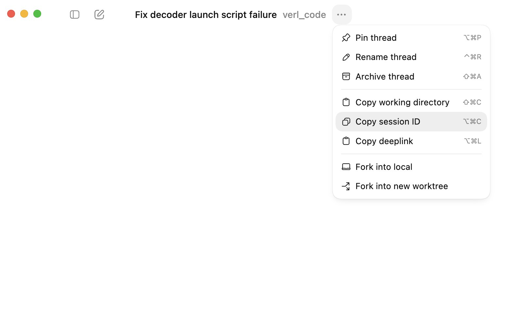

# codex-export

Export any **Codex CLI or Codex Desktop** session to a clean Markdown transcript.

Unlike similar tools, this works with **both** Codex Desktop app sessions and Codex CLI sessions.

Relevant upstream issue: [openai/codex#2880](https://github.com/openai/codex/issues/2880)

## Install (as a Codex skill)

```bash
npx clawhub@latest install codex-export
```

This places the skill in `.agents/skills/codex-export/`. Codex will automatically pick it up when you ask to export a session.

## How to get a session ID

**Codex Desktop app**: click `···` on any thread → **Copy session ID** (or `⌥⌘C`)



**Codex CLI**: run `--list` to browse recent sessions and copy the ID shown below each entry.

## Usage

```bash
# List recent sessions
python3 .agents/skills/codex-export/scripts/export.py --list

# Export by session ID → stdout
python3 .agents/skills/codex-export/scripts/export.py <session-id>

# Export to file
python3 .agents/skills/codex-export/scripts/export.py <session-id> output.md

# Brief mode: user + assistant only, no tool calls
python3 .agents/skills/codex-export/scripts/export.py <session-id> output.md --brief
```

## Output modes

| Mode | User | Assistant | Tool calls | Tool outputs |
|------|------|-----------|------------|--------------|
| default | ✅ | ✅ | ✅ | ✅ |
| `--brief` | ✅ | ✅ | ❌ | ❌ |

System/developer messages and injected context blocks are always filtered out.

## How sessions are stored

Codex stores all sessions locally at `~/.codex/sessions/**/*.jsonl`. The index lives in `~/.codex/state_5.sqlite`. No cloud required — everything is on your machine.
